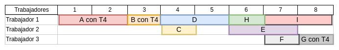

# Problema 1: Monedas

## Solución versión 1


| Importe | Primera sol y num monedas  | Num soluciones | Runtime | 
| ------- | -------------------------- | -------------- | ------- |
| 0,17€   | Monedas:(17, 0, 0, 0, 0, 0, 0, 0) Total monedas: 17 | 28 | 103 ms |
| 1,43€   | Monedas:(143, 0, 0, 0, 0, 0, 0, 0) Total monedas: 143   | 17952 | 1s 250 ms |
| 2,35€   | Monedas:(235, 0, 0, 0, 0, 0, 0, 0) Total monedas: 235  | 150824| 10s 923 ms |
| 4,99€   |   |  |  |

Para el último caso, el tiempo supera los 5 minutos y el entorno me expulsa de la sesión antes de finalizar. 

## Solución versión 2

| Importe | Primera sol y num monedas  | Num soluciones | Runtime | 
| ------- | -------------------------- | -------------- | ------- |
| 0,17€   | Monedas:(17, 0, 0, 0, 0, 0, 0, 0) Total monedas: 17 | 28 | 103 ms |
| 1,43€   | Monedas:(43, 0, 0, 0, 0, 0, 1, 0) Total monedas: 44 | 284 | 170 ms |
| 2,35€   | Monedas:(35, 0, 0, 0, 0, 0, 2, 0) Total monedas: 37 | 324 | 348 ms |
| 4,99€   | Monedas:(99, 0, 0, 0, 0, 0, 4, 0) Total monedas: 103| 13098 | 1s 29ms |


## Solución versión 3

| Importe | sol optima y num monedas  | Num soluciones | Runtime | 
| ------- | -------------------------- | -------------- | ------- |
| 0,17€   | Monedas:(0, 1, 1, 1, 0, 0, 0, 0) Total monedas: 3 | 15 | 105 ms | 
| 1,43€   | Monedas:(1, 1, 0, 0, 2, 0, 1, 0) Total monedas: 5| 40 | 107 ms |
| 2,35€   | Monedas:(0, 0, 1, 1, 1, 0, 0, 1) Total monedas: 4 | 33 | 106 ms |
| 4,99€   | Monedas:(0, 2, 1, 0, 2, 1, 0, 2) Total monedas: 8 | 96 | 130ms |


## Preguntas 

**¿Qué ocurriría si, usando la codificación (a) para encontrar todas las soluciones, el importe buscado es mucho mayor?**

Como en la solución del apartado a) tratamos de encontrar todas las posibles soluciones y estas crecen exponencialmente conforme aumenta el importe se llegaría a un problema inabordable porque el tiempo de ejecución que necesitaría para resolverse sería demasiado grande.

**¿Se podría encontrar alguna solución (usando la codificación de (a) o cualquier otra) de este problema con un importe del orden de los millones de euros? En caso afirmativo, ¿cuál podría ser una estrategia prometedora?**

Claramente para este caso la solución del apartado a) quedaría descartada por lo comentado anteriormente, sin embargo con la solución del apartado c) si que se podría encontrar una solución, aunque tardaría. 

No obstante considero que la estrategia más prometedora sería tratar de dar una solución que minimice el número de monedas que damos de cada tipo. Así evitamos soluciones triviales como dar todas las monedas de un centimo que no son realistas ni útiles. 

Para lograrlo basta añadir restricciones al apartado c) en el cual se pretenda maximizar el número de monedas que se emplea de cada tipo de mayor valor (2€) a menor valor (1 cent). Así se pretendería en un primer caso dar todas las monedas posibles de 2€, seguidas de todas las posibles de 1€, etc... Con esta solución, además se conseguiría el número de monedas óptimo que entregar.


# Problema 2: Asignación de horarios

**¿Cuál es el número de soluciones válidas obtenidas?**
Se han obtenido 2 soluciones válidas.

**¿Existen soluciones simétricas?**
No, las dos soluciones son distintas y no son equivalentes en ningún sentido.

**En caso de que la codificación propuesta contenga soluciones simétricas, ¿cómo se podrían evitar y cuál es el número de soluciones (no simétricas) obtenido?. Explique cómo se consigue la rotura de simetrías (variables y/o restricciones utilizadas para ello), y entregue la solución MZN sin simetrías.**

Por lo comentado en preguntas anteriores, la primera versión de la solución ya fue diseñada para evitar simestrías. La clave ha sido no asignar números diferentes a los distintos bloques de cada asignatura, pues esto habría incrementado el número de soluciones posible ya que dichos bloques serían intercambiables entre ellos y habría gran cantidad de permutaciones posibles. Con la codificación que se ha empleado se evita esto y además no se obtienen soluciones erróneas, pues el orden de los bloques podría tomarse de forma natural.

# Problema 3: Problema Lógico

La solución obtenida es única y es la siguiente: 

El andaluz que vive en la casa amarilla, es diplomático y tiene de mascota un zorro es el que bebe **agua**.
El gallego que vive en la casa verde, es pintor y bebe café es el que tiene de mascota una **Cebra**.


# Problema 4: Construcción de una casa

**¿Cuál es la duración mínima de la construcción de la casa(sin trabajador de apoyo)?**
La duración mínima es de 12 días completos. La solución sería la siguiente:

```
TIEMPO MINIMO = 12
TAREA "A" empieza en tiempo 1, acaba en tiempo 5, y la realiza el trabajador 1
TAREA "B" empieza en tiempo 5, acaba en tiempo 8, y la realiza el trabajador 1
TAREA "C" empieza en tiempo 8, acaba en tiempo 9, y la realiza el trabajador 2
TAREA "D" empieza en tiempo 8, acaba en tiempo 10, y la realiza el trabajador 1
TAREA "E" empieza en tiempo 10, acaba en tiempo 12, y la realiza el trabajador 2
TAREA "F" empieza en tiempo 10, acaba en tiempo 11, y la realiza el trabajador 3
TAREA "G" empieza en tiempo 10, acaba en tiempo 11, y la realiza el trabajador 1
TAREA "H" empieza en tiempo 5, acaba en tiempo 8, y la realiza el trabajador 2
TAREA "I" empieza en tiempo 11, acaba en tiempo 13, y la realiza el trabajador 1
```

**¿Qué tiempo tardarán, como mínimo, los cuatro trabajadores en finalizar la construcción?**

La duración mínima será de 8 días, y el diagrama de Gantt correspondiente a la solución es el siguiente: 




# Problema 5: Coloreo de aristas

**Tabla de resultados**
 
Hemos generado los grafos usando las semillas 1, 2 y 3. 

| Tamaño del grafo | Número de colores mínimo | Runtime (segundos) |
| ---------------- | ------------------------ | ------------------ |
| N=4, M=6         | 2.66666...               | 0.103 s            |
| N=6, M=15	    | 4.66666...               | 0.108 s            |
| N=8, M=28        | 6.33333...               | 0.117 s            |
| N=10, M=45       | 8                        | 0.283 s            |
| N=12, M=66       | 8.66666...               | 0.60567 s          |
| N=14, M=91       | 11                       | 1680 s (28 min)    | 

**¿Diría que este problema es escalable, es decir, se puede abordar su resolución en grafos de un tamaño considerable?**

Teniendo en cuenta que el número de combinaciones posibles para explorar aumenta exponencialmente conforme aumentan los nodos y aristas del grafo (sobre todo las aristas) y en vista de los tiempos de ejecución obtenidos en la tabla (sobre todo para el último caso) este problema no es escalable. Esto se debe a que, conforme aumenta el número de aristas se pueden dar mayores combinaciones de colores, y si aumentan los nodos se puede tardar cada vez más en desechar soluciones, pues los nodos añaden una mayor libertad para asignar colores a las aristas sin violar restricciones, lo que supone más casos a tener en cuenta por el solver Gecode.

Finalmente, creo que no sería viable para resolver grafos cuya solución sea 12 o más colores, pues hasta 11 el tiempo es razonable, pero el incremento en consumo de tiempo para resolver un grafo con 12 colores se dispara enormemente, en concreto pasamos de 7 minutos para una solución de 11 colores a 1h y 7 minutos para una solución de 12.


